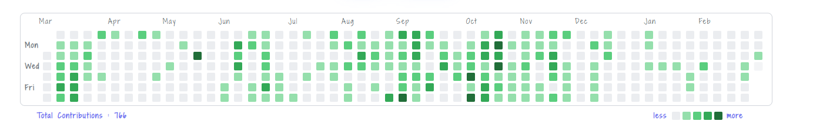

# GitHub Contribution Calendar for React

A customizable React component that displays a **GitHub-style contribution heatmap**.



---

## 🚀 Installation

Install via NPM or Yarn:

```sh
npm install iro-github-cal
# or
yarn add iro-github-cal
```

## 📌 Usage

Import and use the component in your React project:

```tsx
import React from "react";
import GitHubCalendar from "iro-github-cal";

const App = () => {
  return <GitHubCalendar username="your-github-username" />;
};

export default App;
```

## 🎨 Props

| Prop Name   | Type     | Default            | Description                             |
| ----------- | -------- | ------------------ | --------------------------------------- |
| `username`  | `string` | **(required)**     | Your GitHub username.                   |
| `startYear` | `number` | _Current Year - 1_ | Year to start the contributions from.   |
| `theme`     | `string` | `"#216e39"`        | The base color for contribution levels. |

## 🎨 Customization

You can customize the heatmap colors by passing the `theme` prop:

```tsx
<GitHubCalendar username="your-github-username" theme="#ff4500" />
```

